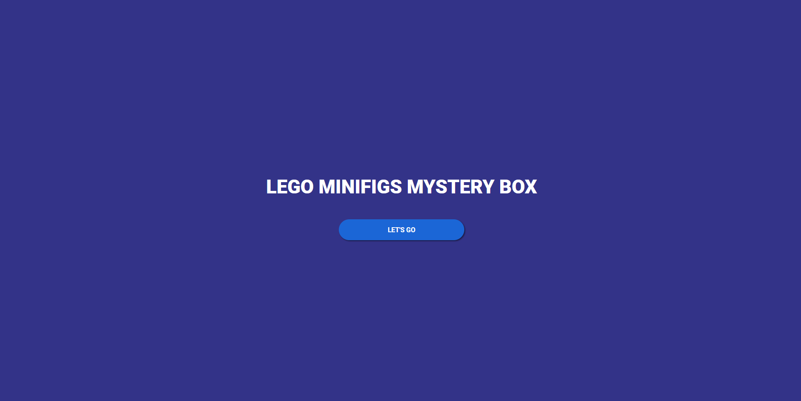
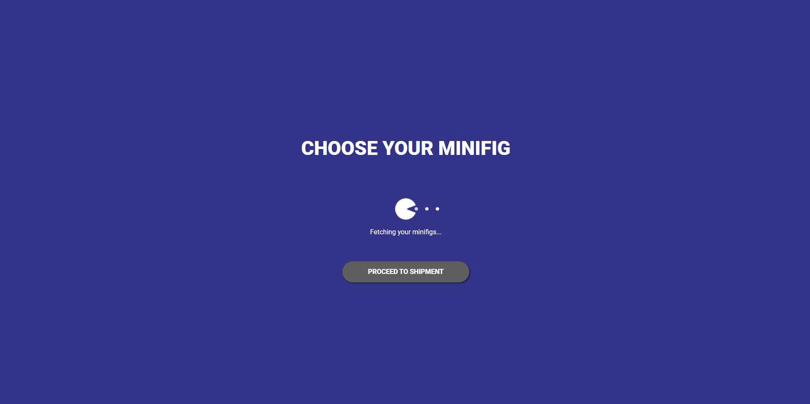
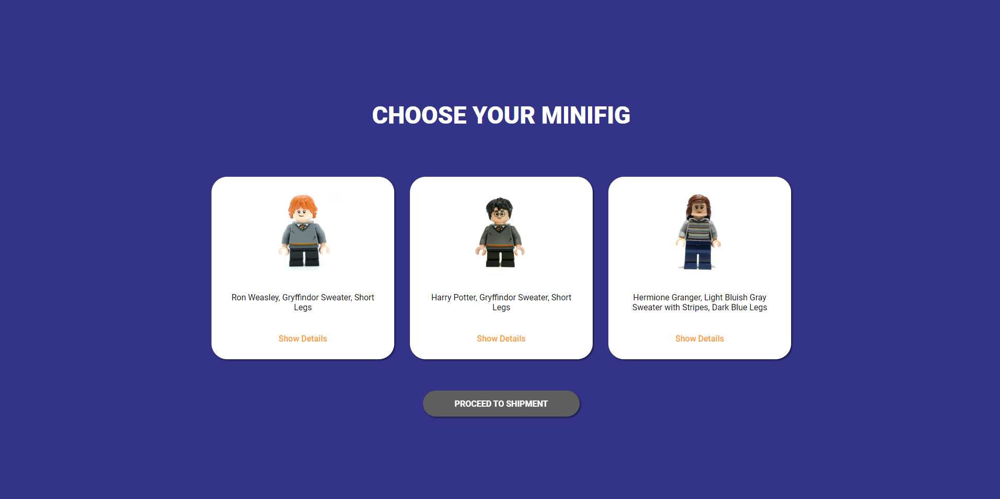
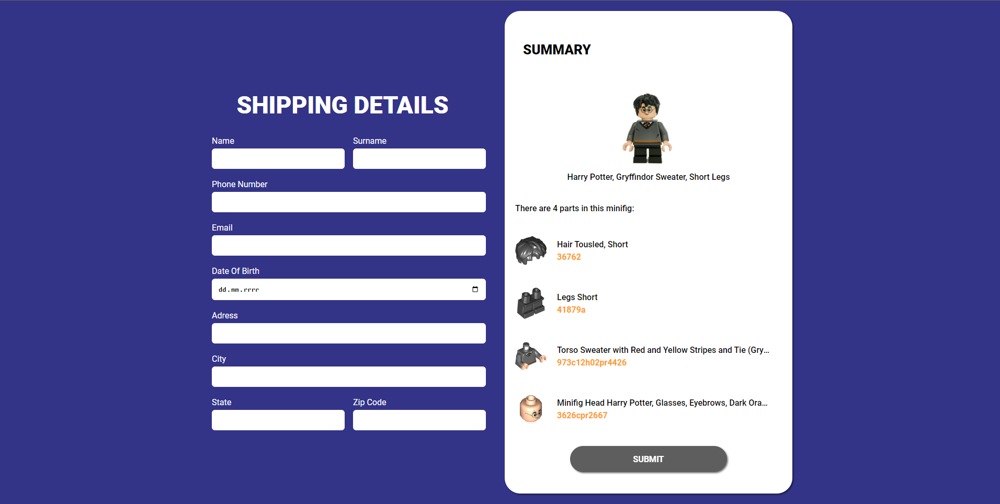

## Description

This is a three-page application that allows users to draw three different LEGO minifigures from the Harry Potter series.

## Running the app

```bash
# install necessary packages
$ npm install

# start app
$ npm start
```

## First page

The first step contains a button that initiates the drawing.



## Second page

The second step involves fetching three random minifigures from the Harry Potter series.




## Third page

The last step is to fill in the shipping details.


